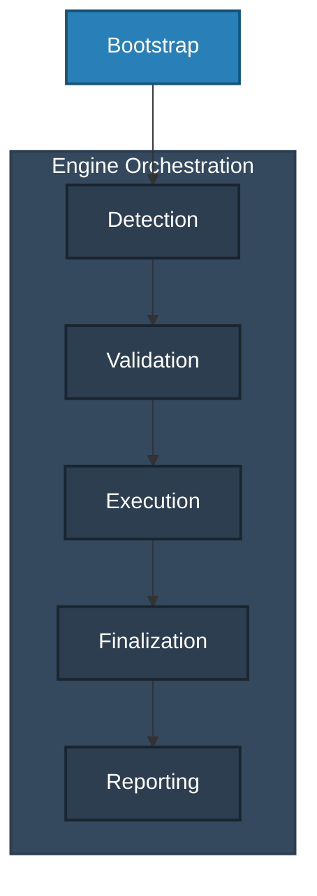
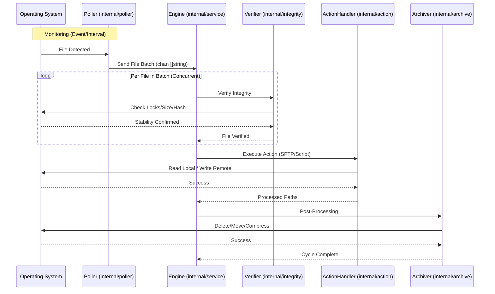

# Architecture & Design: DirPoller

This document outlines the architectural decisions, design patterns, data flow, control logic and dependencies.

## 1. Architecture and Design Choices
-   **Go-Based**: Leverages Go's efficient concurrency model for parallel integrity checks and multi-threaded SFTP uploads.
-   **Platform Agnostic Core**: The application architecture is strictly decoupled. Platform-agnostic core logic (polling, integrity, actions) interacts with OS-native features through interfaces.
-   **Windows Native**: Uses `ReadDirectoryChangesW` for real-time events and `CreateFile` with specific sharing modes for robust lock detection on Windows Server 2019+.
-   **Linux Native**: Uses `inotify` via `fsnotify` for real-time events and standard POSIX advisory locking or stability checks for integrity.
-   **OS Isolation**: Windows-specific implementations (e.g., `ReadDirectoryChangesW`, **Windows EventLog**, and `FILE_SHARE_NONE` locking) are isolated in `*_windows.go` files, while `*_linux.go` files provide the Linux-specific equivalents.
-   **Worker Pools**: Uses semaphore-controlled worker pools for SFTP transfers to optimize throughput without overwhelming system resources.
-   **High-Performance SFTP Engine**: Implements a strict **Atomic Upload Protocol** (Stage -> Transfer -> Rename -> Stat) with **1MB packet optimization** and **multiplexed SSH sessions** for maximum throughput and reliability on modern servers. **Remote Cleanup and Orphan Management** is enforced (startup for CLI, daily 00:00:00 for services). Decryption of SFTP credentials occurs per-batch to ensure memory hygiene. See [DESIGN.md](DESIGN.md) for details.
-   **Stream Processing**: Archiving logic uses `io.Copy` and streaming `zstd` writers to handle large files with minimal memory footprint.
-   **High-Performance Hashing**: Uses `XXH3-128` for rapid file integrity verification with minimal CPU overhead.
-   **Atomic File Operations**: Leverages OS-native locking (`FILE_SHARE_NONE` on Windows, `flock` on Linux) to ensure data consistency.

## 2. OS Portability & Native Integration

DirPoller is designed for native execution on both Windows and Linux, utilizing a strict isolation strategy to leverage platform-specific performance and security features while maintaining a shared codebase.

### 2.1 OS Isolation Strategy
- **Build-Time Isolation**: Native builds are enforced via `//go:build` constraints. Platform-specific logic (e.g., Windows SCM vs. Linux systemd) is strictly contained in `*_windows.go` and `*_linux.go` files to prevent dependency bleed.
- **Interface Abstraction**: Core components interact with the OS through the `OSUtils` and `Logger` interfaces. This allows the `Engine` to remain platform-agnostic while the underlying implementation varies by target environment.

### 2.2 Functional Parity & Differences
| Feature | Windows Implementation | Linux Implementation |
| :--- | :--- | :--- |
| **Service Mode** | Native Windows Service (SCM) | Systemd Parameterized Units |
| **Service Install** | `-install` (CLI) | `-install -name unit@instance` (requires sudo) |
| **Lock Detection** | `CreateFile` (FILE_SHARE_NONE) | `flock` (LOCK_EX \| LOCK_NB) |
| **Real-time Events**| `ReadDirectoryChangesW` | `inotify` (via fsnotify) |
| **System Logging** | Windows Event Log | Syslog / Journald |
| **Path Handling** | Native (`\`) via `filepath` | Native (`/`) via `filepath` |
| **Secret Storage** | Environment Variable | Secured Key File (0600) |

### 2.3 Path Consistency
To ensure consistent behavior across platforms, especially for remote operations:
- **Local Paths**: Always managed via `filepath.Join` and `filepath.Clean` to respect native separators.
- **Remote Paths**: SFTP paths are strictly normalized using `path.Join` to ensure forward-slash (`/`) consistency, regardless of the host OS.

## 3. Package Structure
The project uses a standard Go layout:

```text
dirpoller/
├── cmd/
│   └── dirpoller/          # Application entry point (main.go)
└── internal/
    ├── action/             # Core action handlers (SFTP, Script)
    ├── archive/            # Post-processing (Delete, Move, Compress)
    ├── config/             # JSON configuration and validation
    ├── integrity/          # File stability and lock detection
    ├── poller/             # Directory monitoring strategies
    ├── service/            # Orchestration (Engine) and System Integration
    └── testutils/          # Shared testing helpers
```

- **`cmd/dirpoller`**: The main entry point. Handles CLI flag parsing, configuration loading, and starts the polling engine.
- **`internal/action`**: Implements the `ActionHandler` interface. Includes the high-performance SFTP engine (with atomic upload protocol) and the external script execution engine.
- **`internal/archive`**: Responsible for the file lifecycle after successful processing. Supports direct deletion, moving to datestamped folders, or multi-threaded `zstd` compression.
- **`internal/config`**: Defines the configuration schema and strictly validates all parameters (e.g., path existence, mutual exclusivity of options).
- **`internal/integrity`**: Ensures files are "stable" before processing. Implements lock detection (platform-specific), size monitoring, and XXH3-128 hashing.
- **`internal/poller`**: Provides multiple discovery algorithms (`interval`, `batch`, `event`, `trigger`). Uses OS-native APIs for real-time monitoring.
- **`internal/service`**: The "brain" of the application. The `Engine` orchestrates the flow between the poller, verifier, and action handlers. Also contains platform-specific service management (Windows Service integration via `winsvc` and Linux Systemd support via provided unit files).

## 4. Data Flow and Control Logic

### 4.1 Operational Flow
DirPoller operates as a linear pipeline orchestrated by the **Engine**. The flow ensures that files are only processed once they are stable and verified, preventing data corruption or partial transfers.



1.  **Bootstrap**: `main.go` loads configuration, resolves secrets (SFTP passwords), and initializes the `Engine`.
2.  **Detection**: The `Poller` monitors the source directory and emits batches of file paths via a Go channel.
3.  **Validation**: The `Engine` receives a batch and initiates concurrent `Integrity` checks (locks, size stability, hashing).
4.  **Execution**: Verified files are handed to the `ActionHandler` (SFTP or Script).
5.  **Finalization**: Successfully processed files are handled by the `Archiver` (Delete, Move, or Compress).
6.  **Reporting**: Every cycle generates an activity report via the `CustomLogger`.

### 4.2 Data Sequence Diagram


### 4.3 Code Relations
-   **internal/service/engine.go**: The central orchestrator. It holds references to all other components via interfaces.
-   **internal/poller/**: Independent discovery modules. They communicate with the engine solely through channels.
-   **internal/action/sftp.go**: Implements high-performance atomic transfers with 1MB optimizations and session multiplexing.
-   **internal/config/config.go**: Defines the shared state and validation rules for the entire pipeline.

## 5. Dependencies

### 5.1 External Libraries
-   **fsnotify/fsnotify**: Cross-platform file system notifications (used for real-time events on both Windows and Linux).
-   **klauspost/compress/zstd**: High-performance multi-threaded zstd compression for batch archiving.
-   **pkg/sftp**: Robust SFTP client implementation for remote transfers.
-   **google/uuid**: Generates unique identifiers for the Atomic Upload Protocol staging phase.
-   **zeebo/xxh3**: High-performance XXH3-128 hash algorithm for enhanced collision resistance for file integrity verification.
-   **golang.org/x/crypto/ssh**: Provides the underlying secure transport for SFTP operations.
-   **golang.org/x/sys**: Direct access to OS APIs for service management, file locking, and system logging.

### 5.2 Internal Modules
-   **criticalsys/secretprotector**: Mandatory encryption layer for securing SFTP credentials at rest and in memory.
